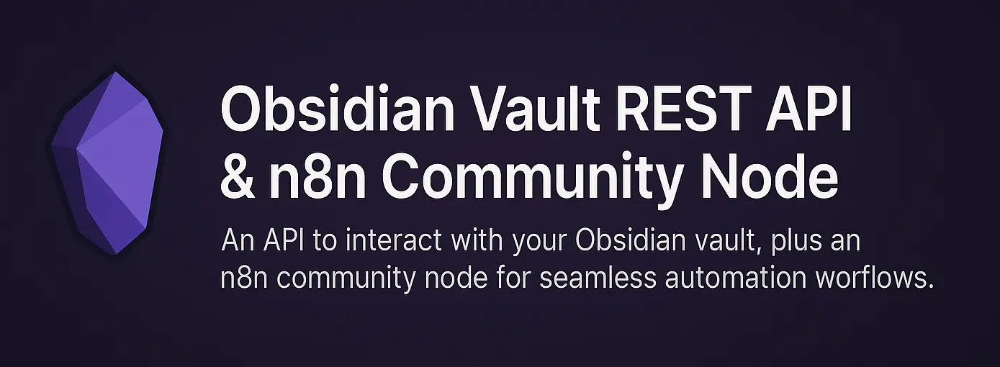

# n8n-nodes-obsidian-local-rest-api

A community node for n8n that allows you to interact with your Obsidian Vault via a REST API.



## Prerequisites

Before using this node, you must have the [Obsidian Vault REST API](https://github.com/j-shelfwood/obsidian-local-rest-api) set up and running (e.g. at `http://localhost:8000`). Follow that repository's README to install and start the API.

## Installation

```bash
npm install n8n-nodes-obsidian-local-rest-api
```

## Credentials

### Credentials

**Obsidian Vault API** credentials are optional for local development. If your API does not require authentication (e.g. when running locally), you can leave the Access Token blank.

- **Host**: URL of your Obsidian Vault REST API (e.g. `http://localhost:8000` or your custom domain like `http://obsidian-local-rest-api.test`)
- **Access Token**: Your bearer token (leave blank for no authentication)

To use a custom domain (e.g. with Laravel Valet), set the Host field to your local domain, such as `http://obsidian-local-rest-api.test`.

After installing the node, go to Credentials in n8n, search for "Obsidian Vault API", and create a credential. Then select it in your node.

## Node

After installing and connecting your credentials, add the **Obsidian Vault REST API** node. Select your **Resource** and **Operation** as defined in the bundled OpenAPI spec.

## Local Development

To test this node locally with your n8n instance:

1.  **Clean your project:** Remove `node_modules`, `dist`, and any lock files (`bun.lockb`, `package-lock.json`).
    ```bash
    rm -rf node_modules dist bun.lockb package-lock.json
    ```
2.  **Install dependencies:**
    ```bash
    npm install
    ```
3.  **Build the project:**
    ```bash
    npm run build
    ```
4.  **Clean n8n custom nodes directory:** Remove any existing links or nodes from `~/.n8n/custom/`.
    ```bash
    rm -rf ~/.n8n/custom/*
    ```
5.  **Create a symbolic link:** Link your project directory to the n8n custom nodes directory. Replace `/path/to/your/n8n-nodes-obsidian-local-rest-api` with the actual absolute path to your project.

    ```bash
    ln -s /Users/shelfwood/Projects/n8n-nodes-obsidian-local-rest-api ~/.n8n/custom/n8n-nodes-obsidian-local-rest-api
    ```

    _Note: Ensure you use the absolute path to your project directory for the symbolic link._

6.  **Restart n8n:** If n8n is already running, restart it to pick up the new custom node.

Your node should now be available in your local n8n instance.

## Building & Publishing

- Source TypeScript lives under `src/`.
- On `npm install` or before publishing, the `prepare` script runs `npm run build` to compile TypeScript and bundle the OpenAPI spec & icon into `dist/`.
- CI (GitHub Actions) does `npm ci`, `npm run build`, then `npm publish` on tags `v*.*.*`.

---

_Feedback and contributions welcome!_
